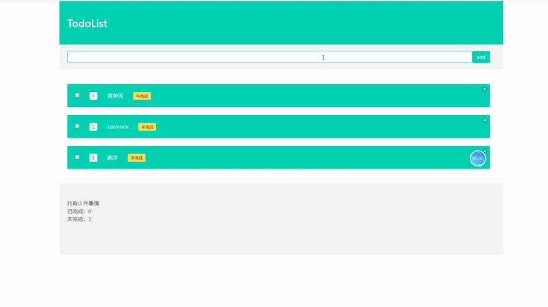

# 敏捷web大作业

Spring boot的依赖和前端的node_modules都因为过大没有推送上来，Jest测试放在了前端/src/ _ test _ 这里

### 项目具体介绍

* 后台使用Spring boot进行开发,数据库使用Mysql
* 后台运用JPA+Spring Data进行数据库的操作，增删改查等功能，
* 使用lombok减少java代码的冗长，使用**WebMvcConfigurerAdapter**解决跨域问题
* 前端使用react进行开发，sass进行样式管理，使用bulma美化框架进行美化
* 前端使用axios与后端进行数据交互
* 测试部分，后台使用Junit5进行单元测试，前端主要使用Jest进行单元测试
* e2e测试上，主要使用mocha和puppeteer和mocha进行测试

### 效果图

***

> 作业内容[一] 
> ---------
>
> 完成Web应用程序Todo List的开发。
>
> a. 语言不限。
>
> b. 前后端分离，各自部署。后端为RESTful API，前端通过Ajax请求与后端交互。 
>
> c. 使用TDD进行功能开发。
>
> d. 功能包括：
>
>  i. 返回所有Todo任务
>
>  ii. 创建一个新的Todo任务 
>
> iii. 修改一个Todo任务
>
> iv. 删除一个Todo任务 e. 用e2e测试保证最终可用性。 
>
> f. 小步提交，提交数量不少于15个，提交消息表意且与提交代码一致。
>
> 
>
> 作业内容[二] 
> ---------
>
> 总结至少20个在作业一中遇到的新知识点 
>
> ● 可以是语法、框架中的知识点，也可以是工程实践中的知识点 
>
> ● 总结包括： 
>
> ​	○ 出处 
>
> ​	○ 使用场景 
>
> ​	○ 代码中的作用 
>
> ​	○ 其他你认为重要的内容
>
> 
>
> 作业要求
> ---------
>
> 1. 四人一组，协作开发 
>
> 2.  代码提交到Github，要能看到每个人的提交记录 
>
> 3. 实验报告以Word格式提交，包括 
>
>    a. 团队成员 
>
>    b. 代码的Github地址 
>
>    c. 问题分析与任务拆分 
>
>    d. 知识点列表 
>
> 4. 提交时间：4月22日

